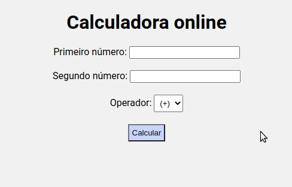

# online-calculator-java

 - Web application using servlet and JSP to calculate basic math operations given two input numbers.
 - Output result and hit counter.

<b>Operations:</b>
 | Addition | Subtraction |
 | -------- | ----------- |
 |  |  |
 
 | Multiplication | Division |
 | -------------- | -------- |
 |  |  |
